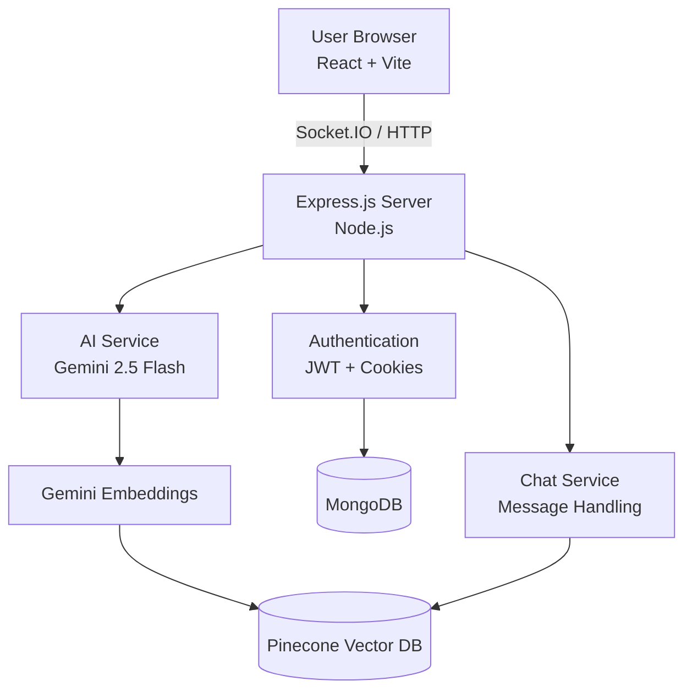

```mermaid
graph TD
    A[User Browser<br/>React + Vite]
    B[Express.js Server<br/>Node.js]

    A -->|Socket.IO / HTTP| B

    B --> C[Authentication<br/>JWT + Cookies]
    B --> D[AI Service<br/>Gemini 2.5 Flash]
    B --> E[Chat Service<br/>Message Handling]

    C --> F[(MongoDB)]

    D --> G[Gemini Embeddings]
    G --> H[(Pinecone Vector DB)]

    E --> H
```